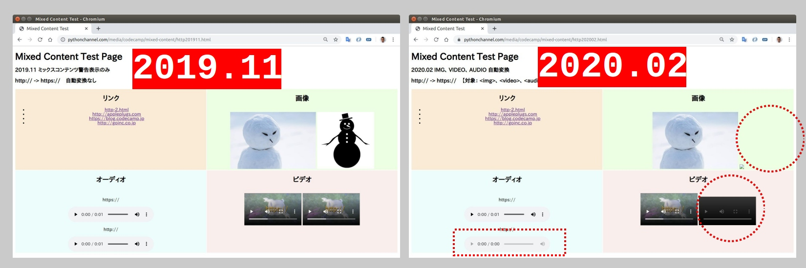

## プログラムの意味

2020.02 にアップグレード予定の Google Chrome 81[*](https://security.googleblog.com/2019/10/no-more-mixed-messages-about-https_3.html) に対する事前対策。

【2020.02 イメージ図】



## WordPress サイトでもプラグインじゃ...

プラグインだと http:// を一括して https:// に変換、 画像が読み込めなくなってページデザインが崩れるリスクも...


## プログラム実行結果

今回は ライティングのお仕事でお世話になっている CodeCampus さんのサイトをテストしてみました。
少しコードを変えると、他のサイトでも利用可能でしょう。

```
● 結果　●　
http:// -> https:// 変換時にエラーとなった 画像 URL
45

対策が必要なページ
23

チェックしたページ数
1267

チェックにかかった時間（プログラムの実行時間）
1時間 30分

プログラム自体の作成時間
8時間

実際の HTML コードの変更は行っていません。
対策が必要な 23ページについては手作業で修正、がいいかな。
```


混合コンテンツについてお困りなことがございましたら、大島、ご検討ください。

oshimamasara@gmail.com

